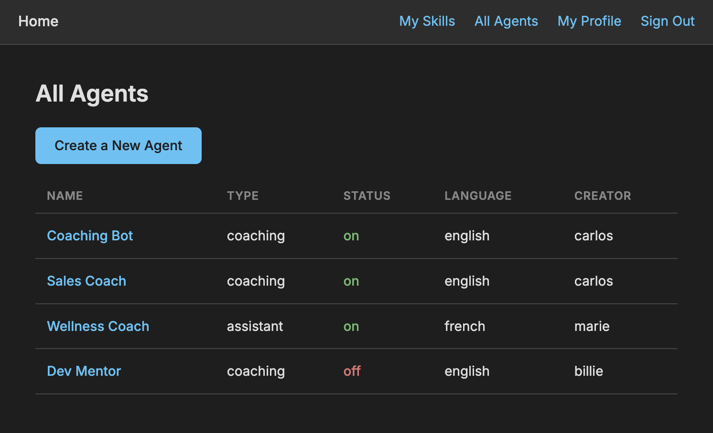

# Agent Builder & Preview

An AI Agent Builder and Preview application built with the MEN stack (MongoDB, Express.js, Node.js) and EJS templating. Users create Skills, assemble Agents from those Skills with personality modes, and preview/chat with their Agents via the Anthropic Claude API — all in a dark-themed developer tool interface.

## Motivation

The internet of agents: this app explores how AI agents are configured and tested. It is intented as a developer-oriented tool where users define skills as reusable building blocks, compose agents from those skills, and preview agent behavior in real time with full visibility into the system prompt assembly.

## Features

- **Session-based authentication** with sign-up, sign-in, and sign-out
- **Skills CRUD** — create, view, edit, and delete reusable AI skill definitions
- **Agents CRUD** — assemble agents from skills with personality modes (coaching, assistant, role-play, customer-care), custom personality notes, and on/off status
- **Agent Preview** — ask your agent questions and receive AI-generated responses via the Anthropic Claude API
- **Multi-language support** — agents respond in the user's selected language (English, French, Spanish, Italian, Portuguese)
- **Dev Mode toggle** — view the assembled system prompt behind the scenes using native HTML5 `
`/`
`
- **Authorization** — only the creator of a skill or agent can edit or delete it; all logged-in users can browse and preview
- **Dark mode theme** — VS Code-inspired developer tool aesthetic with WCAG 2.0 AA compliant contrast ratios

## Getting Started

- **Deployed app**: [https://agent-builder-preview.onrender.com](https://agent-builder-preview.onrender.com)
- **Planning materials**: [planning/](planning/) folder in this repo (ERD, wireframes, user stories)

### Demo accounts

| Username | Password | Language |
|----------|----------|----------|
| carlos   | test123  | english  |
| marie    | test123  | french   |
| billie   | test123  | english  |

## Technologies Used

- **Runtime**: Node.js
- **Framework**: Express.js
- **Database**: MongoDB Atlas with Mongoose ODM
- **Templating**: EJS (Embedded JavaScript)
- **Authentication**: bcrypt + express-session + connect-mongo
- **AI Integration**: Anthropic Claude API (claude-sonnet-4-20250514)
- **CSS**: Custom dark theme with CSS variables, Flexbox layout
- **Font**: Inter (Google Fonts)
- **Logging**: Morgan

## Attributions

- [Anthropic Claude API](https://docs.anthropic.com/) — AI model powering agent responses
- [Express.js](https://expressjs.com/) — web framework
- [Mongoose](https://mongoosejs.com/) — MongoDB ODM
- [EJS](https://ejs.co/) — templating engine
- [bcrypt](https://www.npmjs.com/package/bcrypt) — password hashing
- [connect-mongo](https://www.npmjs.com/package/connect-mongo) — session store
- [Inter font](https://fonts.google.com/specimen/Inter) — typography
- [WebAIM Contrast Checker](https://webaim.org/resources/contrastchecker/) — WCAG 2.0 AA verification

## Design Decisions

1. **Bare-bones wireframes first** — focused on data model and CRUD flow before any styling
2. **Dark mode as intentional choice** — this is a developer/admin tool; dark themes match the tools developers use daily
3. **Six-color palette** — three grays for depth, white text, one accent blue, one danger red. Constraint breeds consistency
4. **WCAG 2.0 AA compliance** — every text/background pairing exceeds 4.5:1 contrast ratio minimum
5. **Flexbox layout** — body column, nav row, centered content, action button groups, form stacking
6. **Referenced documents over embedded** — Skills and Agents are separate collections with `createdBy` foreign keys, not embedded in User. This supports the many-to-many relationship between Agents and Skills
7. **Feature-by-feature build order** — built end-to-end per feature (model → controller → views → test), not layer-by-layer

## Next Steps / Roadmap

1. **Light mode toggle** — CSS variables are already set up for easy theme switching
2. **PersonalityPrompt as separate model** — replace hardcoded enum with seed data and ObjectId reference
3. **AI-generated skill summaries** — call Anthropic API on skill creation to generate polished `aiSummary`
4. **AI-generated agent job descriptions** — infer agent's job from loaded skills on create/update
5. **Multi-turn chat** — persist conversation history for back-and-forth preview sessions
6. **External API / web search** — integrate Brave Search API for grounded responses
7. **Custom personality transformation** — AI-enhance raw user personality notes at preview time
8. **Memory / chat history persistence** — save and resume preview conversations
9. **Channel integration** — proactive agents with cron jobs and scheduled outreach
10. **Testing status** — pre-prod vs prod environments for agents
